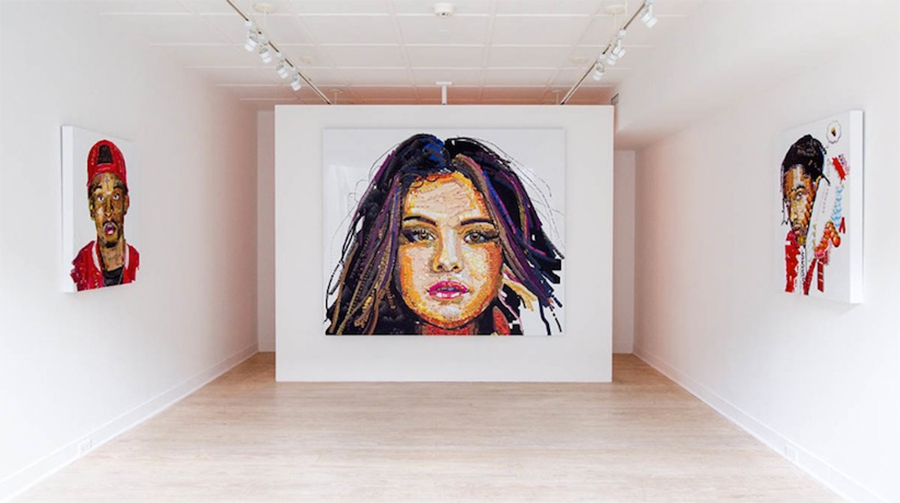

# Emoji Portraits

- Date: May 2, 2020
- Medium: Digitally produced images printed on canvas
- Title: Emoji Portraits, from left to right: portrait 1 (3' x 3'), portrait 2 (5' x 4'), portrait 3 (3' x 3')
- Description: Portraits of prominent Internet influencers drawn using emojis

For my final work I chose some of the strongest portraits I produced with emoji.ink and had them printed on canvas. Here I displayed three of the portraits at a friend's studio and photographed them from the perspective of someone entering the gallery. I experimented with presenting the works online, as a custom website or on social media, as this is where much of my research took place, but in the end, as someone with a painting background, I realized it was important for me to position my emoji portraits within the history of painting and portraiture. This is why I chose to print the final works on canvas and place them in a traditional gallery context, to ensure the viewer would recognize my intention to contribute directly to the history of portraiture in fine art. In an era of social media, emojis have become a popular form of self expression used by influencers and followers alike, by choosing to use emojis to create these portraits of some of the most "influential" figures of this era, I'm hoping to immortalize not only the influencers but the feeling of self expression in the age of social media itself.
