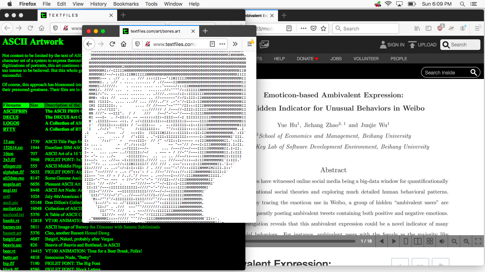

# Emoji Research

- Date: March 3, 2020
- Description: Going through materials at the International Emoji Archives

- Date: April 5, 2020
- Description: Screen shot of my research the online Internet Archive and textfiles archive.

The first image is taken from my trip to the Internet Archive, it depicts Brewster Kahle, the founder and director of the archive, explaining to the tour group how often the servers (shown on the right) are requested from on a daily basis. My visit to the archive allowed me to interview Internet historians like Jason Scott to get their first hand accounts of how emoticons, the focus of my research, where used in the earliest days of the Internet. The second image is a screen shot of my online research. On the left is Jason Scott's online text-files archive, which includes a large collection of early ASCII art (images created from text characters) which directly inspired my notion to create portraits from emojis. On the right is one of the many research papers i read on how emoji's are used in various online platforms as a means of self expression. 
