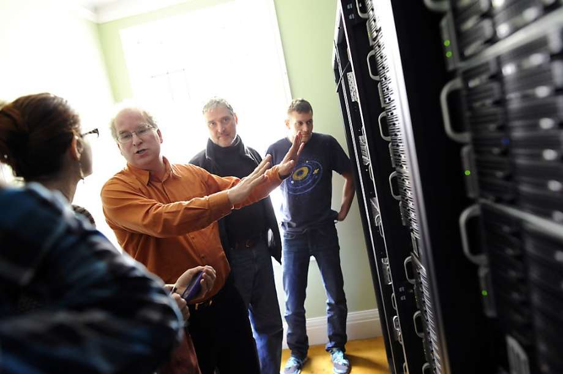

# Livestreaming Research
 Research

- Date: April 14, 2020
- Description: Sketches of different final piece ideas.

![researchphotos.png]

- Date: April 14, 2020
- Description: Screen shots of articles and sites I visited while researching mental health in livestreaming on Twitch in specific.

Links - https://www.psyberguide.org/blog/guest-blog/where-twitch-can-help-with-mental-health/

		https://kotaku.com/suicide-threats-are-a-big-problem-on-twitch-1821235980
        
        https://twitchtracker.com/statistics
        
The top two screenshots are from kotaku's article which talks about how streamers interact with viewers who are suffering from mental health issues. In that article in specific, it is addressing depression and suicide. This article gives more insight into how both the viewers and streamers can both be affected, it is not just the streamer who has to deal with these problems.

The bottom left screenshot is from the website twitchtracker which tracks a whole bunch of statistics on Twitch. That screenshot is showing the growth of the platform and how many viewers on average are watching weekyl, daily, etc. This site gives me insight into how many people are using the platform and how much it has grown over the years that it has been active. It helps with giving context to just exactly how big this livestreaming thing is today. This site is good because it gives me more concrete evidence such as numbers and graphs, whereas the other sources i've visited are more narrative.

The bottom right screenshot is an article from psyberguide.org which talks about how twitch can help viewers and streamers with their mental health. This article and kotaku's article both bring up the idea of community being created between the content creators and their followers, so I think it is a good idea to have that concept in mind for my final piece.

